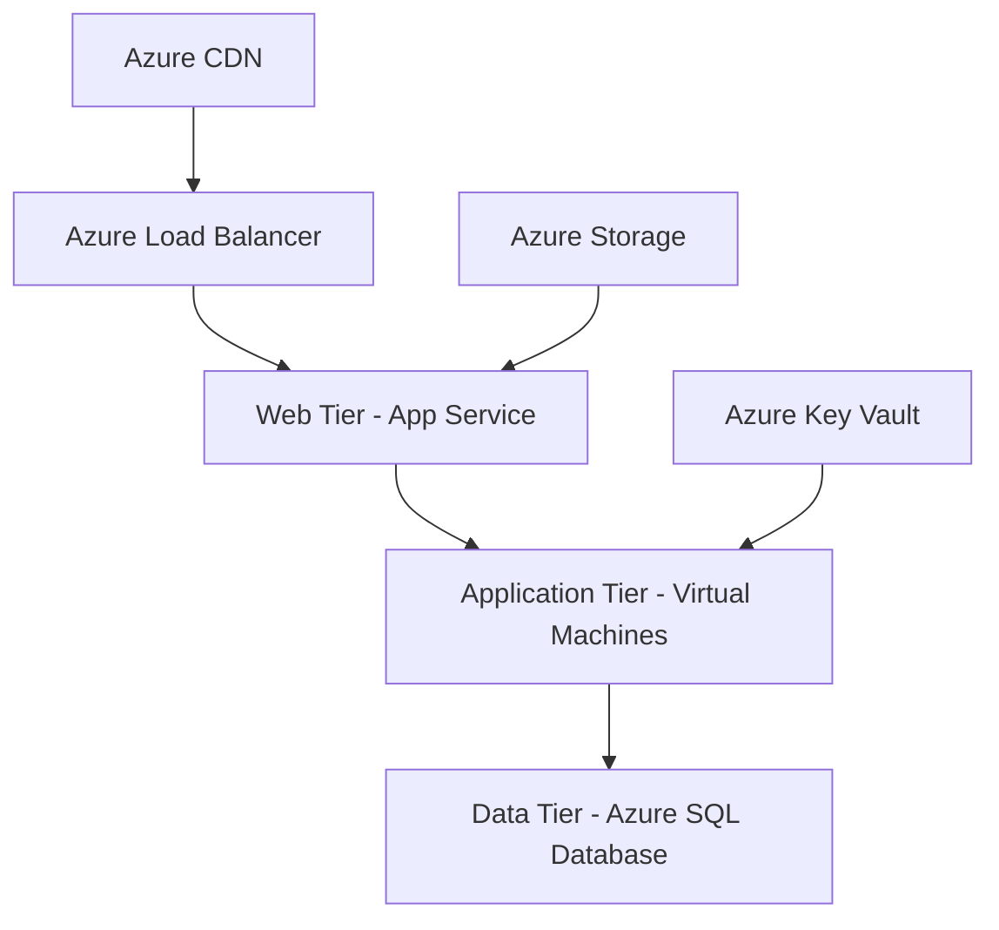

# Microsoft Azure - Componentes de Arquitetura 🚀

[](https://azure.microsoft.com/)
[](LICENSE)
[](https://docs.microsoft.com/azure/)

## 📖 Sobre

Este repositório contém um **guia completo e resumido** dos principais componentes de arquitetura do Microsoft Azure, focado em fornecer uma visão clara e prática para desenvolvedores, arquitetos de soluções e profissionais de TI.

## 🎯 Objetivo

Oferecer uma referência rápida e didática sobre:
- Conceitos fundamentais do Azure
- Componentes de infraestrutura
- Melhores práticas de organização
- Exemplos práticos de implementação

## 📚 Conteúdo

### 🏗️ Componentes Principais

| Componente | Descrição | Casos de Uso |
|------------|-----------|--------------|
| **Regions** | Datacenters geograficamente distribuídos | Latência, compliance, disaster recovery |
| **Resource Groups** | Contêineres lógicos para organização | Gerenciamento centralizado, controle de acesso |
| **ARM** | Engine de implantação e gerenciamento | Automação, templates, IaC |
| **Compute** | Serviços de processamento | VMs, containers, serverless |
| **Storage** | Soluções de armazenamento | Blobs, files, databases |
| **Networking** | Infraestrutura de rede | Conectividade, segurança, balanceamento |
| **Databases** | Bancos de dados gerenciados | SQL, NoSQL, analytics |
| **IAM** | Identidade e controle de acesso | Autenticação, autorização, SSO |
| **Monitoring** | Observabilidade e otimização | Métricas, logs, alertas |
| **Security** | Proteção e compliance | Threat detection, encryption |

## 🚀 Início Rápido

### Pré-requisitos
- Conta Microsoft Azure ativa
- Azure CLI instalado
- Conhecimento básico de cloud computing

### Criando seu primeiro Resource Group

```bash
# Login no Azure
az login

# Criar resource group
az group create \
  --name "meu-primeiro-rg" \
  --location "Brazil South"

# Listar resource groups
az group list --output table
```

### Exemplo: Deploy de uma VM simples

```bash
# Criar VM no resource group
az vm create \
  --resource-group "meu-primeiro-rg" \
  --name "minha-vm" \
  --image "Ubuntu2204" \
  --admin-username "azureuser" \
  --generate-ssh-keys
```


## 🏆 Melhores Práticas

### 🗂️ Organização de Resource Groups
- **Por ambiente**: `app-dev-rg`, `app-prod-rg`
- **Por aplicação**: `ecommerce-rg`, `blog-rg`
- **Por departamento**: `marketing-rg`, `finance-rg`

### 🏷️ Convenção de Nomenclatura
```
{workload}-{environment}-{region}-{resource-type}
Exemplo: webapp-prod-brs-vm
```

### 💰 Otimização de Custos
- Use **tags** para rastreamento de custos
- Implemente **auto-scaling** para recursos variáveis
- Configure **alertas de orçamento**
- Utilize **Azure Advisor** para recomendações

## 🛠️ Ferramentas Recomendadas

| Ferramenta | Propósito | Link |
|------------|-----------|------|
| **Azure CLI** | Linha de comando | [Download](https://docs.microsoft.com/cli/azure/) |
| **Azure PowerShell** | Automação PowerShell | [Download](https://docs.microsoft.com/powershell/azure/) |
| **Visual Studio Code** | Editor com extensões Azure | [Download](https://code.visualstudio.com/) |
| **Azure Storage Explorer** | Gerenciamento de storage | [Download](https://azure.microsoft.com/features/storage-explorer/) |
| **Terraform** | Infrastructure as Code | [Download](https://www.terraform.io/) |

## 📊 Exemplos Práticos

### 🌐 Arquitetura Web 3-Tier



### 🏗️ Microserviços com Containers

```yaml
# docker-compose.yml exemplo
version: '3.8'
services:
  web:
    image: nginx
    ports:
      - "80:80"
  api:
    image: node:16
    environment:
      - DB_CONNECTION_STRING=${AZURE_SQL_CONNECTION}
  database:
    image: mcr.microsoft.com/mssql/server:2019-latest
```

## 🔧 Troubleshooting

### Problemas Comuns

**Erro de Quota**
```bash
# Verificar quotas atuais
az vm list-usage --location "Brazil South" --output table
```

**Problemas de Conectividade**
```bash
# Testar conectividade de rede
az network watcher test-connectivity \
  --source-resource /subscriptions/.../myVM \
  --dest-address www.google.com \
  --dest-port 80
```

## 📈 Monitoramento e Alertas

### Dashboard Básico
- **CPU Utilization**: < 80%
- **Memory Usage**: < 85%  
- **Disk Space**: > 20% livre
- **Network Latency**: < 100ms

### Alertas Recomendados
```json
{
  "alertName": "High CPU Usage",
  "condition": "CPU > 80%",
  "frequency": "5 minutes",
  "action": "Email + SMS"
}
```

## 🤝 Contribuindo

1. **Fork** o projeto
2. Crie uma **branch** para sua feature (`git checkout -b feature/nova-feature`)
3. **Commit** suas mudanças (`git commit -m 'Add: nova feature'`)
4. **Push** para a branch (`git push origin feature/nova-feature`)
5. Abra um **Pull Request**

### Padrões de Commit
- `Add:` para novas funcionalidades
- `Fix:` para correções
- `Update:` para atualizações
- `Docs:` para documentação

## 📚 Recursos Adicionais

### 🎓 Certificações Azure
- **AZ-900**: Azure Fundamentals
- **AZ-104**: Azure Administrator
- **AZ-204**: Azure Developer
- **AZ-303/304**: Azure Architect

### 📖 Documentação Oficial
- [Azure Documentation](https://docs.microsoft.com/azure/)
- [Azure Architecture Center](https://docs.microsoft.com/azure/architecture/)
- [Azure Quickstart Templates](https://azure.microsoft.com/resources/templates/)

### 🛠️ Labs e Hands-on
- [Microsoft Learn](https://docs.microsoft.com/learn/azure/)
- [Azure Citadel](https://azurecitadel.com/)
- [GitHub Azure Samples](https://github.com/Azure-Samples)
