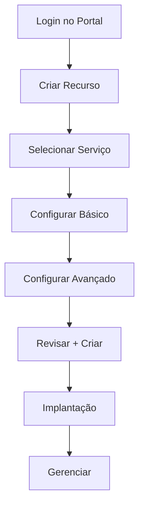

# Microsoft Azure - Guia Completo de Configuração e Uso

[](https://azure.microsoft.com/)
[](https://github.com)

## 📋 Índice

- [O que é Microsoft Azure?](#-o-que-é-microsoft-azure)
- [Modelos de Serviço](#-modelos-de-serviço)
- [Configuração Inicial](#-configuração-inicial)
- [Processo de Criação de Recursos](#-processo-de-criação-de-recursos)
- [Conceitos Fundamentais](#-conceitos-fundamentais)
- [Segurança](#-segurança)
- [Disponibilidade e Backup](#-disponibilidade-e-backup)
- [Boas Práticas](#-boas-práticas)
- [Configuração do Azure SQL Database](#-configuração-do-azure-sql-database)
- [Monitoramento e Custos](#-monitoramento-e-custos)
- [Ferramentas e CLI](#-ferramentas-e-cli)
- [Recursos Adicionais](#-recursos-adicionais)

---

## ☁️ O que é Microsoft Azure?

Microsoft Azure é a plataforma de computação em nuvem da Microsoft que oferece mais de 200 serviços para construir, executar e gerenciar aplicações através de datacenters globais.

### 🏗️ Modelos de Serviço

| Modelo | Descrição | Exemplos |
|--------|-----------|----------|
| **IaaS** | Infraestrutura como Serviço | Máquinas Virtuais, Redes, Armazenamento |
| **PaaS** | Plataforma como Serviço | App Service, SQL Database, Functions |
| **SaaS** | Software como Serviço | Office 365, Dynamics 365 |

---

## 🚀 Configuração Inicial

### Pré-requisitos

- Conta Microsoft ativa
- Cartão de crédito válido (para verificação)
- Acesso à internet estável

### Primeiro Acesso

1. **Acesse o Portal Azure**
   ```
   https://portal.azure.com
   ```

2. **Faça login** com sua conta Microsoft

3. **Configure sua assinatura** (se necessário)

---

## 🔧 Processo de Criação de Recursos

### Fluxo Padrão



### Passos Detalhados

1. **Criar um Recurso**
   - Clique em `+ Criar um recurso`
   - Pesquise o serviço desejado
   - Selecione o template apropriado

2. **Configuração Básica**
   - **Assinatura**: Selecione a assinatura ativa
   - **Grupo de Recursos**: Crie novo ou use existente
   - **Nome**: Use convenção de nomenclatura consistente
   - **Região**: Escolha baseado na latência e compliance

3. **Configuração Avançada**
   - **Plano de Preços**: Selecione SKU apropriado
   - **Configurações de Rede**: Configure VNet, subnets, NSGs
   - **Segurança**: Configure autenticação e autorização
   - **Monitoramento**: Habilite logs e métricas

4. **Validação e Criação**
   - Revisar todas as configurações
   - Validar custos estimados
   - Criar o recurso

---

## 📚 Conceitos Fundamentais

### 🗂️ Organização de Recursos

| Conceito | Descrição | Exemplo |
|----------|-----------|---------|
| **Subscription** | Contêiner de cobrança e gerenciamento | Subscription de Produção |
| **Resource Group** | Agrupamento lógico de recursos | `rg-webapp-prod-eastus` |
| **Resource** | Serviço individual do Azure | VM, SQL Database, Storage |
| **Region** | Localização física dos datacenters | Brazil South, East US |

### 🏷️ Convenção de Nomenclatura

```
<tipo-recurso>-<aplicacao>-<ambiente>-<regiao>-<numero>

Exemplos:
- vm-webapp-prod-brazilsouth-01
- sql-ecommerce-dev-eastus-01
- storage-backup-prod-westus-01
```

### 🔖 Sistema de Tags

```json
{
  "Environment": "Production",
  "Application": "WebApp",
  "Owner": "DevTeam",
  "CostCenter": "IT-001",
  "Project": "E-commerce"
}
```

---

## 🔒 Segurança

### Controle de Acesso

#### RBAC (Role-Based Access Control)

```bash
# Atribuir role de Contributor para um usuário
az role assignment create \
  --assignee user@domain.com \
  --role "Contributor" \
  --scope "/subscriptions/{subscription-id}/resourceGroups/{resource-group}"
```

#### Roles Principais

| Role | Permissões | Uso Recomendado |
|------|------------|-----------------|
| **Owner** | Acesso completo | Administradores |
| **Contributor** | Gerenciar recursos (sem acesso) | Desenvolvedores |
| **Reader** | Apenas leitura | Auditores |
| **User Access Administrator** | Gerenciar acessos | Equipe de Segurança |

### Segurança de Rede

#### Network Security Groups (NSG)

```json
{
  "securityRules": [
    {
      "name": "AllowHTTPS",
      "protocol": "Tcp",
      "sourcePortRange": "*",
      "destinationPortRange": "443",
      "access": "Allow",
      "priority": 100,
      "direction": "Inbound"
    }
  ]
}
```

#### Firewall Configuration

```bash
# Adicionar regra de firewall para SQL Database
az sql server firewall-rule create \
  --resource-group myResourceGroup \
  --server myServer \
  --name AllowMyIP \
  --start-ip-address 203.0.113.0 \
  --end-ip-address 203.0.113.0
```

---

## 🔄 Disponibilidade e Backup

### Opções de Redundância

| Tipo | Descrição | Durabilidade | Uso |
|------|-----------|--------------|-----|
| **LRS** | Locally Redundant Storage | 99.999999999% | Dados não críticos |
| **ZRS** | Zone Redundant Storage | 99.9999999999% | Alta disponibilidade |
| **GRS** | Geo Redundant Storage | 99.99999999999999% | Disaster Recovery |
| **RA-GRS** | Read-Access GRS | 99.99999999999999% | Leitura global |

### SLA (Service Level Agreement)

| Serviço | SLA | Downtime/Mês |
|---------|-----|--------------|
| **Virtual Machines** | 99.95% | 21.6 min |
| **SQL Database** | 99.99% | 4.3 min |
| **App Service** | 99.95% | 21.6 min |
| **Storage** | 99.9% | 43.2 min |

---

## ✅ Boas Práticas

### 🎯 Estratégias de Organização

#### Estrutura de Grupos de Recursos

```
Production Environment:
├── rg-webapp-prod-eastus
│   ├── App Service
│   ├── SQL Database
│   └── Storage Account
├── rg-network-prod-eastus
│   ├── Virtual Network
│   ├── Load Balancer
│   └── Application Gateway
└── rg-monitoring-prod-eastus
    ├── Log Analytics
    ├── Application Insights
    └── Automation Account
```

#### Tags Estratégicas

```yaml
# Exemplo de estrutura de tags
Environment: [Dev, Test, Staging, Prod]
Application: [WebApp, API, Database, Cache]
Owner: [TeamA, TeamB, External]
CostCenter: [IT-001, MKT-002, HR-003]
Project: [ProjectAlpha, ProjectBeta]
Criticality: [Low, Medium, High, Critical]
```

### 💰 Otimização de Custos

#### Monitoramento Proativo

```bash
# Criar orçamento
az consumption budget create \
  --budget-name "Monthly-Budget" \
  --amount 1000 \
  --time-grain Monthly \
  --time-period start-date=2024-01-01 \
  --notifications enabled=true threshold=80
```

#### Estratégias de Economia

1. **Reserved Instances**: Economize até 72% em VMs
2. **Spot Instances**: Economize até 90% em cargas não críticas
3. **Auto-scaling**: Ajuste automático baseado na demanda
4. **Scheduled Shutdown**: Desligue recursos em horários não úteis

### 🔧 Automação

#### Azure CLI Examples

```bash
# Criar Resource Group
az group create --name myResourceGroup --location eastus

# Criar Storage Account
az storage account create \
  --name mystorageaccount \
  --resource-group myResourceGroup \
  --location eastus \
  --sku Standard_LRS

# Criar Virtual Machine
az vm create \
  --resource-group myResourceGroup \
  --name myVM \
  --image UbuntuLTS \
  --admin-username azureuser \
  --generate-ssh-keys
```

#### ARM Template Básico

```json
{
  "$schema": "https://schema.management.azure.com/schemas/2019-04-01/deploymentTemplate.json#",
  "contentVersion": "1.0.0.0",
  "parameters": {
    "storageAccountName": {
      "type": "string",
      "metadata": {
        "description": "Nome da Storage Account"
      }
    }
  },
  "resources": [
    {
      "type": "Microsoft.Storage/storageAccounts",
      "apiVersion": "2021-04-01",
      "name": "[parameters('storageAccountName')]",
      "location": "[resourceGroup().location]",
      "sku": {
        "name": "Standard_LRS"
      },
      "kind": "StorageV2"
    }
  ]
}
```

---

## 🗄️ Configuração do Azure SQL Database

### Checklist Completo

#### ✅ Preparação

- [ ] Definir grupo de recursos
- [ ] Escolher região apropriada
- [ ] Planejar convenção de nomenclatura
- [ ] Estimar custos

#### ✅ Configuração do Servidor

```bash
# Criar SQL Server
az sql server create \
  --name myserver \
  --resource-group myResourceGroup \
  --location eastus \
  --admin-user adminuser \
  --admin-password ComplexPassword123!
```

#### ✅ Configuração do Banco de Dados

```bash
# Criar Database
az sql db create \
  --resource-group myResourceGroup \
  --server myserver \
  --name mydatabase \
  --service-objective S0
```

#### ✅ Configuração de Segurança

```bash
# Configurar Firewall
az sql server firewall-rule create \
  --resource-group myResourceGroup \
  --server myserver \
  --name AllowAzureServices \
  --start-ip-address 0.0.0.0 \
  --end-ip-address 0.0.0.0
```

#### ✅ String de Conexão

```csharp
// .NET Connection String
Server=tcp:myserver.database.windows.net,1433;
Initial Catalog=mydatabase;
Persist Security Info=False;
User ID=adminuser;
Password=ComplexPassword123!;
MultipleActiveResultSets=False;
Encrypt=True;
TrustServerCertificate=False;
Connection Timeout=30;
```

#### ✅ Configurações de Performance

| Tier | DTU | Armazenamento | Uso Recomendado |
|------|-----|---------------|------------------|
| **Basic** | 5 DTU | 2 GB | Desenvolvimento |
| **Standard S0** | 10 DTU | 250 GB | Teste |
| **Standard S2** | 50 DTU | 250 GB | Produção Pequena |
| **Premium P1** | 125 DTU | 500 GB | Produção |

---

## 📊 Monitoramento e Custos

### Azure Monitor

#### Métricas Essenciais

```kusto
// Query para CPU usage
Perf
| where ObjectName == "Processor"
| where CounterName == "% Processor Time"
| where InstanceName == "_Total"
| summarize AvgCPU = avg(CounterValue) by bin(TimeGenerated, 5m)
```

#### Alertas Automáticos

```bash
# Criar alerta de CPU
az monitor metrics alert create \
  --name "High CPU Alert" \
  --resource-group myResourceGroup \
  --scopes /subscriptions/{subscription-id}/resourceGroups/{rg}/providers/Microsoft.Compute/virtualMachines/{vm-name} \
  --condition "avg Percentage CPU > 80" \
  --description "Alert when CPU exceeds 80%"
```

### Cost Management

#### Dashboard de Custos

```bash
# Obter análise de custos
az consumption usage list \
  --billing-period-name 202401 \
  --top 10
```

#### Budget Alerts

```json
{
  "budgetType": "Cost",
  "amount": 1000,
  "timeGrain": "Monthly",
  "notifications": {
    "Actual_GreaterThan_80_Percent": {
      "enabled": true,
      "operator": "GreaterThan",
      "threshold": 80,
      "contactEmails": ["admin@company.com"]
    }
  }
}
```

---

## 🛠️ Ferramentas e CLI

### Instalação do Azure CLI

#### Windows
```powershell
# Via PowerShell
Invoke-WebRequest -Uri https://aka.ms/installazurecliwindows -OutFile .\AzureCLI.msi
Start-Process msiexec.exe -Wait -ArgumentList '/I AzureCLI.msi /quiet'
```

#### Linux
```bash
# Ubuntu/Debian
curl -sL https://aka.ms/InstallAzureCLIDeb | sudo bash

# CentOS/RHEL
sudo rpm --import https://packages.microsoft.com/keys/microsoft.asc
sudo sh -c 'echo -e "[azure-cli]\nname=Azure CLI\nbaseurl=https://packages.microsoft.com/yumrepos/azure-cli\nenabled=1\ngpgcheck=1\ngpgkey=https://packages.microsoft.com/keys/microsoft.asc" > /etc/yum.repos.d/azure-cli.repo'
sudo yum install azure-cli
```

#### macOS
```bash
# Via Homebrew
brew update && brew install azure-cli
```

### Azure PowerShell

```powershell
# Instalação
Install-Module -Name Az -Repository PSGallery -Force

# Login
Connect-AzAccount

# Listar recursos
Get-AzResource | Select-Object ResourceGroupName, Name, ResourceType
```

### Comandos Essenciais

```bash
# Login
az login

# Listar assinaturas
az account list --output table

# Definir assinatura padrão
az account set --subscription "subscription-id"

# Listar grupos de recursos
az group list --output table

# Listar recursos em um grupo
az resource list --resource-group myResourceGroup --output table

# Obter informações de uso
az vm list-usage --location eastus --output table
```

---

## 📖 Recursos Adicionais

### Documentação Oficial

- [Azure Documentation](https://docs.microsoft.com/azure/)
- [Azure CLI Reference](https://docs.microsoft.com/cli/azure/)
- [Azure PowerShell Reference](https://docs.microsoft.com/powershell/azure/)

### Ferramentas de Terceiros

- **Terraform**: Infrastructure as Code
- **Ansible**: Configuration Management
- **Pulumi**: Cloud Native Infrastructure

### Certificações Recomendadas

| Certificação | Nível | Descrição |
|--------------|-------|-----------|
| **AZ-900** | Fundamentals | Azure Fundamentals |
| **AZ-104** | Associate | Azure Administrator |
| **AZ-204** | Associate | Azure Developer |
| **AZ-303/304** | Expert | Azure Solutions Architect |

### Comunidade e Suporte

- [Azure Community](https://techcommunity.microsoft.com/t5/azure/ct-p/Azure)
- [Stack Overflow - Azure](https://stackoverflow.com/questions/tagged/azure)
- [Reddit - r/AZURE](https://www.reddit.com/r/AZURE/)

---

## 🔧 Troubleshooting Comum

### Problemas de Conectividade

```bash
# Testar conectividade com SQL Database
sqlcmd -S myserver.database.windows.net -d mydatabase -U adminuser -P ComplexPassword123!

# Verificar regras de firewall
az sql server firewall-rule list --resource-group myResourceGroup --server myserver
```

### Problemas de Performance

```bash
# Verificar métricas de VM
az vm get-instance-view --resource-group myResourceGroup --name myVM

# Verificar logs de aplicação
az monitor activity-log list --resource-group myResourceGroup
```

### Problemas de Custos

```bash
# Analisar custos por serviço
az consumption usage list --top 5 --output table

# Verificar orçamentos
az consumption budget list --output table
```

---

